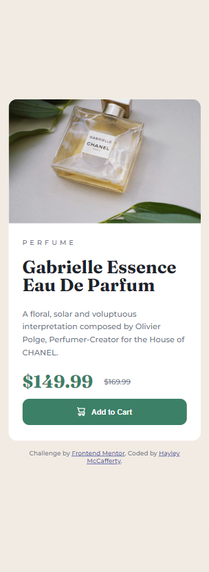

# Product Preview Card Component

Challenge from [Frontend Mentor](https://www.frontendmentor.io/)

## Usage

The purpose of this project was to practice HTML, CSS and JavaScript skills with
a design from Frontend Mentor challenge

## Challenge Description

"This HTML & CSS-only challenge will be perfect for anyone starting to build
responsive projects."

## Tech Stack

**Client:** HTML, CSS

## Authors

- [@haylzrandom - Frontend Mentor](https://www.frontendmentor.io/profile/HaylzRandom)
- [@HaylzRandom - GitHub](https://github.com/HaylzRandom)

## Acknowledgements

- [Product Preview Card Component](https://www.frontendmentor.io/challenges/product-preview-card-component-GO7UmttRfa)

## Related

Here are some related projects

- [NFT Preview Card Component](https://github.com/HaylzRandom/nft-preview-card-component)
- [Order Summary Component](https://github.com/HaylzRandom/order-summary-component)
- [Stats Preview Component](https://github.com/HaylzRandom/stats-preview-card-component)

## Screenshots

Desktop Screenshot

 Mobile Screenshot

